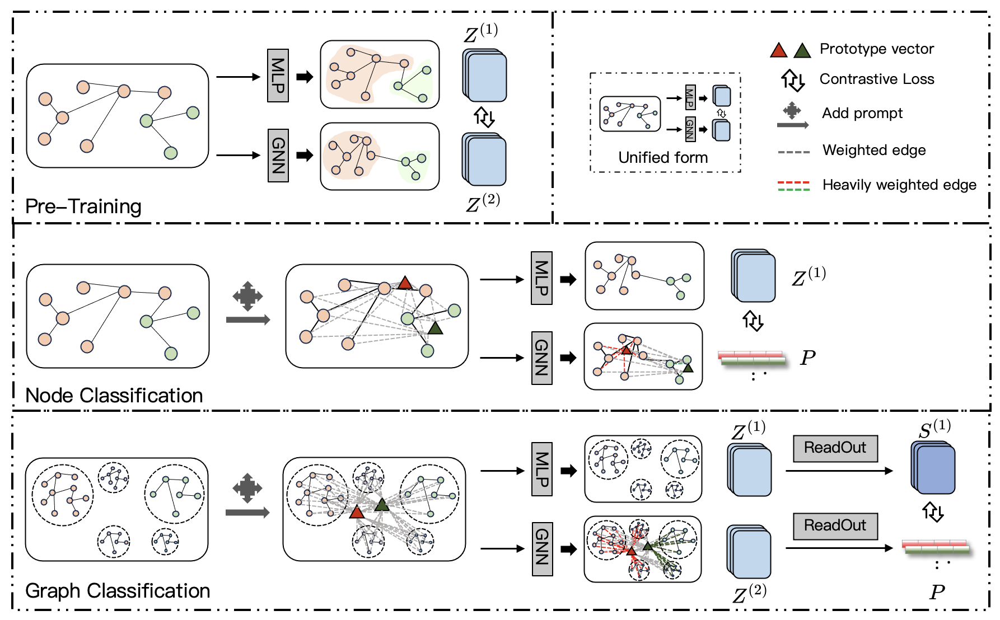

# PSP: Pre-Training and Structure Prompt Tuning for Graph Neural Networks

This repository is the official implementation of *PSP: Pre-Training and Structure Prompt Tuning for Graph Neural Networks*.



## Setup

This implemetation is based on Python3. To run the code, you need the following dependencies:

> python==3.9.0 \
> torch==1.12.0 \
> torch-geometric==2.3.1 \
> torch-cluster==1.6.0 \
> torch-scatter==2.1.0 \
> torch-sparse==0.6.15 \
> torch-spline-conv==1.2.1 \
> networkx==2.8.5 \
> scikit-learn==1.1.3 \
> scipy==1.9.3 \
> numpy==1.23.5 \
> pandas==1.5.2

## Usage

### Node Classification
Default dataset is COX2. You need to change the corresponding parameters in pre_train.py and prompt.py to train and evaluate on other datasets.

Pretrain:
```
python pre_train.py
```
Prompt tune and test:
```
python prompt.py
```

### Graph Classification
Default dataset is CiteSeer. You need to change the corresponding parameters in pre_train.py and prompt_graph.py to train and evaluate on other datasets.

Pretrain:
```
python pre_train.py
```
Prompt tune and test:
```
python prompt_graph.py
```
